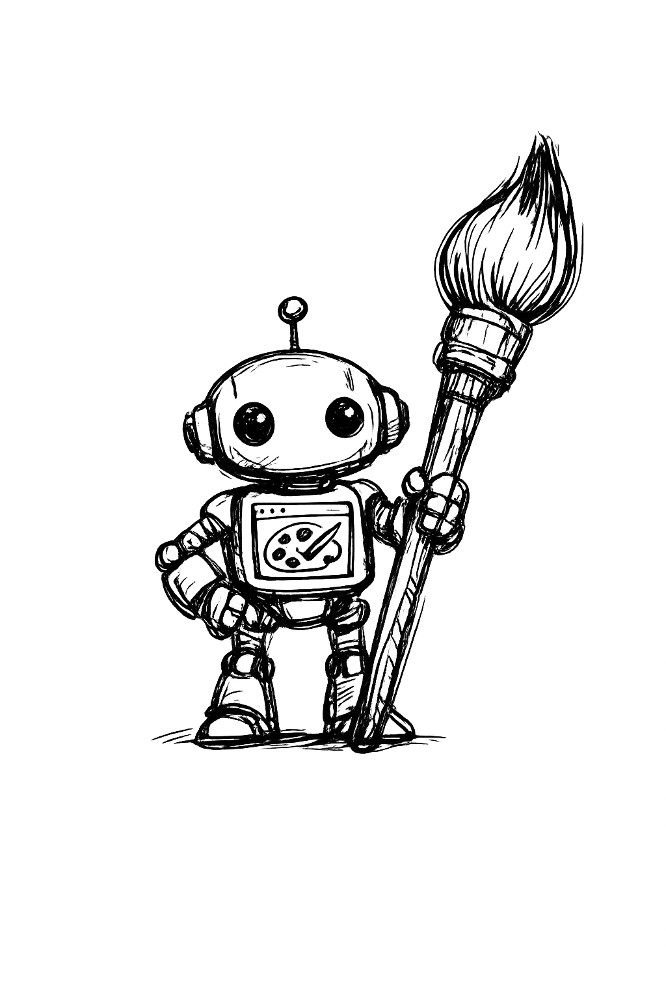

<div align="center">
  
  <h1>image-gen</h1>
  <p><strong>MCP image generation for AI coding agents — no OpenAI API key</strong></p>
  <p>Drives your own logged-in ChatGPT session in a dedicated browser profile,<br/>downloads the PNG, and drops it into your project.</p>
</div>

---

## Why this exists

Most agent image tools need an OpenAI API key and burn credits. **image-gen** borrows the ChatGPT plan you already pay for (Free / Plus / Pro), runs generation in a real browser, and returns a local file path your agent can embed immediately.

Built for **Cursor**, **Claude Code**, **Claude Desktop**, and any MCP client.

---

## Features

- One-time login into a **dedicated Edge auth profile** (does not touch your daily browser)
- **Attach-first** CDP — reconnects if the browser is already open; never force-kills your normal Edge
- Auto-clicks ChatGPT’s **Welcome back / Choose an account** picker
- Session backup via `chatgpt-storage.json` (cookies restored if needed)
- Reference-image uploads for variations / style matching
- Auto-dismisses ChatGPT’s **“image was already uploaded”** / duplicate-file modal
- Transparent-background prompt helper for icons and UI marks
- Thread-safe image detection (ignores older images already in the chat)
- Parallel `generate_image` calls are **queued** (in-process + file lock)

---

## Requirements

| Requirement | Notes |
|---|---|
| **Node.js 18+** | Required to run the MCP server |
| **Microsoft Edge** | Default on Windows. Chrome works with the same flags + a dedicated profile |
| **ChatGPT account** | Free works; Plus/Pro usually means better image quality / limits |
| **MCP client** | Cursor, Claude Code, Claude Desktop, etc. |

---

## Quick start (5 minutes)

### 1. Install

```bash
git clone https://github.com/nothariharan/image-gen.git
cd image-gen
npm install
```

### 2. One-time ChatGPT login

```bash
npm run login
```

What happens:

1. A **dedicated** Edge window opens (`edge-auth-profile/`) on port `9222`
2. Your normal/daily Edge is left alone
3. Log into ChatGPT fully in that window (Google / password / 2FA)
4. When the chat composer appears, the script saves `chatgpt-storage.json` and exits

**Do not delete** these after login:

- `edge-auth-profile/` — browser profile with your session
- `chatgpt-storage.json` — cookie backup (gitignored)

### 3. Verify

```bash
npm run test-connection
# → Connected! The browser has N open context(s).
```

### 4. Register the MCP with your agent

Use the **absolute path** to `mcp-server.mjs` on your machine.

#### Cursor

Open `~/.cursor/mcp.json` (Windows: `%USERPROFILE%\.cursor\mcp.json`) and add:

```json
{
  "mcpServers": {
    "image-gen": {
      "command": "node",
      "args": ["C:/Users/YOU/playwright-image-gen/mcp-server.mjs"]
    }
  }
}
```

Reload Cursor (or toggle the MCP off/on). The tool appears as `generate_image` on server `image-gen` / `user-image-gen`.

**Tip:** In chat, invoke explicitly with `/chatgpt-image-gen` or say “use the image-gen MCP” so the agent doesn’t use Cursor’s built-in image tool.

#### Claude Code

```bash
claude mcp add -s user image-gen node /absolute/path/to/image-gen/mcp-server.mjs
```

#### Claude Desktop

Edit your Claude Desktop MCP config and add the same `command` / `args` block as Cursor.

---

## Everyday use

Once login is done, your agent calls:

```text
generate_image
```

### Parallel calls are queued (important)

ChatGPT is a **single shared browser tab**. If two `generate_image` jobs type at once, prompts interleave into garbage text.

**v2.4+ serializes every job** with an in-process queue + cross-process `.generate.lock` file. Parallel MCP calls wait their turn instead of colliding. You may still call multiple times from the agent — they run one after another automatically.

If a job crashes hard and leaves a stuck lock, delete `image-gen/.generate.lock` (or wait until it goes stale, ~6 minutes).

| Parameter | Type | Required | Description |
|---|---|---|---|
| `prompt` | string | yes | Subject, style, palette, mood, composition |
| `filename` | string | no | Output name without extension (default `generated_<timestamp>`) |
| `output_dir` | string | no | Save directory (prefer project `public/` or `assets/`) |
| `transparent_background` | boolean | no | Appends no-background instructions (icons/logos) |
| `reference_images` | string[] | no | Absolute local paths to attach as visual context |

**Example calls**

```jsonc
{
  "prompt": "rainy city street at night, neon reflections, cinematic, wide shot",
  "filename": "hero",
  "output_dir": "./public"
}
```

```jsonc
{
  "prompt": "minimalist calendar icon, thin lines, dark blue",
  "filename": "icon-calendar",
  "output_dir": "./public/icons",
  "transparent_background": true
}
```

```jsonc
{
  "prompt": "same character but angrier, keep the art style",
  "filename": "mascot-angry",
  "output_dir": "./public",
  "reference_images": ["C:/path/to/project/public/mascot.png"]
}
```

Returns: absolute path of the saved PNG.

---

## How auth persistence works

```text
npm run login  →  edge-auth-profile + chatgpt-storage.json
        ↓
generate_image
        ↓
  Is port 9222 up? ──yes──► attach (no browser kill)
        │
        no
        ↓
  Launch ONLY edge-auth-profile on :9222
        ↓
  Restore cookies from chatgpt-storage.json if needed
        ↓
  Auto-click Welcome-back account picker if shown
        ↓
  Generate + download PNG + refresh storage file
```

### When might ChatGPT still ask you to log in again?

OpenAI does **not** publish an exact cookie TTL. In practice, sessions often last **weeks to months** if the auth profile is left alone. Re-login is usually triggered by things like:

| Event | What to do |
|---|---|
| You changed your ChatGPT / Google password | `npm run login` again |
| You used “Log out of all devices” / revoked sessions | `npm run login` again |
| Long inactivity + OpenAI security challenge | Complete challenge once, or `npm run login` |
| You deleted `edge-auth-profile` or `chatgpt-storage.json` | `npm run login` again |
| OpenAI forced a platform-wide re-auth | `npm run login` again |

Day-to-day use of this MCP should **not** log you out by itself anymore (it no longer kills your daily browser or mixes profiles).

---

## Environment variables

| Variable | Default | Purpose |
|---|---|---|
| `IMAGE_GEN_CDP_PORT` | `9222` | Chrome DevTools Protocol port |
| `IMAGE_GEN_PROFILE_DIR` | `./edge-auth-profile` | Dedicated browser profile directory |
| `IMAGE_GEN_STORAGE_STATE` | `./chatgpt-storage.json` | Cookie / storage backup file |
| `IMAGE_GEN_CHATGPT_EMAIL` | _(optional)_ | Prefer this email on the account picker |

Example (Windows PowerShell):

```powershell
$env:IMAGE_GEN_CHATGPT_EMAIL = "you@example.com"
node mcp-server.mjs
```

Or in Cursor `mcp.json`:

```json
{
  "mcpServers": {
    "image-gen": {
      "command": "node",
      "args": ["C:/Users/YOU/playwright-image-gen/mcp-server.mjs"],
      "env": {
        "IMAGE_GEN_CHATGPT_EMAIL": "you@example.com"
      }
    }
  }
}
```

---

## How generation works (technical)

Playwright attaches over CDP, finds/opens a `chatgpt.com` tab, types the prompt, and waits for:

```text
img[alt^="Generated image"]
```

Primary path waits until the `src` stops changing for ~3 seconds (preview → final swap), then fetches the signed Estuary URL from inside the page.

**Fallback chain**

1. Stable `img[alt^="Generated image"]` → in-page fetch  
2. Largest `image/*` network response during generation (≥ 80 KB)  
3. Newest large `` in the DOM  

Conversation streams are parsed only to detect refusals early (3‑minute hard timeout otherwise).

---

## Tab / thread behavior

- Reuses the first open `chatgpt.com` tab; leaves it open afterward  
- Keep the tab open → generations stay in one thread (good for iteration)  
- Close the tab → next call starts a fresh conversation  
- Want a specific thread → open that URL in the auth-profile browser first  

Collision guard: snapshots existing generated-image `src`s before sending the prompt, then only accepts new ones.

---

## Scripts

| Command | What it does |
|---|---|
| `npm run login` | One-time (or rare re-) login + save session |
| `npm run test-connection` | Launch/attach auth profile and verify CDP |
| `npm start` | Run the MCP server on stdio |
| `launch-edge.bat` | Windows helper to start the auth profile on `:9222` |

---

## macOS / Linux

There is no `.bat` helper, but the flow is the same: dedicated profile + remote debugging + `npm run login`.

```bash
# Example: Chrome with a dedicated profile
google-chrome \
  --remote-debugging-port=9222 \
  --remote-allow-origins=* \
  --user-data-dir="$PWD/edge-auth-profile" \
  https://chatgpt.com
```

Then in another terminal:

```bash
npm run login   # if you still need to complete/save login
npm start
```

---

## Troubleshooting

| Symptom | Fix |
|---|---|
| `Cannot connect to Edge on port 9222` | Run `npm run login` or `launch-edge.bat`. Confirm nothing else is broken on that port: open `http://127.0.0.1:9222/json/version` |
| Asked to log in again | Run `npm run login`. Don’t delete `edge-auth-profile` / `chatgpt-storage.json` |
| Stuck on **Welcome back** | MCP auto-clicks; set `IMAGE_GEN_CHATGPT_EMAIL` if the wrong account is listed |
| `ChatGPT refused` | Content policy — rephrase the prompt |
| Timed out after 3 minutes | Check rate limits / Plus status in ChatGPT manually |
| Agent used built-in image tool instead | Say “use image-gen MCP / `generate_image`” or `/chatgpt-image-gen` in Cursor |
| Reference images skipped | Paths must exist and be absolute from the MCP process |
| Stuck on **image was already uploaded** | v2.4.1+ auto-dismisses `#modal-duplicate-file`; reload the MCP if you’re still on an older process |
| Wrong chat thread | Close extra `chatgpt.com` tabs in the auth-profile window |

---

## Security & privacy

- Session files are **local secrets**. They are gitignored. Never commit or share `chatgpt-storage.json` or `edge-auth-profile/`.
- The MCP talks to ChatGPT through **your** browser session — treat the machine like it’s logged into ChatGPT.
- This project is **not affiliated with OpenAI**. Automating ChatGPT may conflict with OpenAI’s terms depending on use; for production/commercial scale, prefer the official Images API.

---

## Limitations

- **Slow** — typically 15–60s per image (3 min hard cap)  
- **One image at a time** — jobs are queued and run serially  

- **DOM can change** — selectors may need updates after big ChatGPT UI changes  
- **Account rate limits** apply (especially Free)  
- Not a drop-in replacement for high-volume API generation  

---

## Project layout

```text
image-gen/
├── mcp-server.mjs       # MCP entry (stdio)
├── generate.mjs         # CDP attach, login, generation, download
├── login-once.mjs       # One-time auth setup
├── setup-session.mjs    # Connection smoke test
├── launch-edge.bat      # Windows auth-profile launcher
├── edge-auth-profile/   # Created locally — gitignored
├── chatgpt-storage.json # Created locally — gitignored
└── assets/
```

---

## License

[MIT](./LICENSE) — not affiliated with OpenAI or Anthropic.
